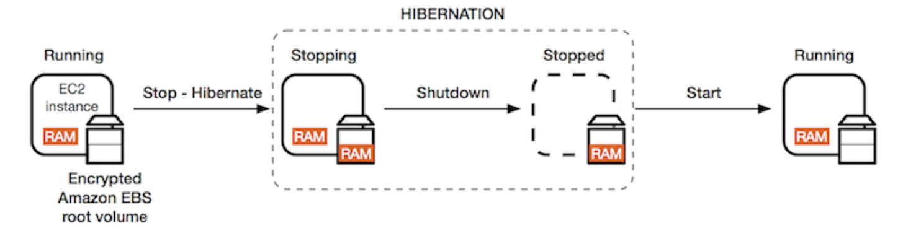

# Hibernate

- We know we can stop, terminate instances
    - Stop: the data on disk (EBS) is kept intact in the next start
    - Terminate: any EBS volumes (root) also set-up to be destroyed is lost

        → But if it is an EBS volume that is attached as a secondary drive, and that it's not meant to be destroyed when your instance is being terminated, then you will keep the data obviously.

- On start, the following happens:
    - First start: the OS boots & the EC2 User Data script is run
    - Following starts: the OS boots up
    - Then your application starts, caches get warmed up, and that can take time!

# EC2 Hibernate

- The in-memory (RAM) state is preserved
- The instance boot is much faster!

    (the OS is not stopped / restarted)

    → Because it's really tough to maintain a memory state obviously, the whole state of RAM is going to be dumped into a file onto the root EBS volume. And that root EBS volume therefore must be encrypted.

- Under the hood: the RAM state is written to a file in the root EBS volume

→ We have encrypted EBS volume and the RAM. Upon we stop and hibernate, the Ram is going to be dumped onto the encrypted Amazon EBS root volume, and then the instance will be stopped. So there will be a shutdown of the instance, but not the OS, and then when we restart it, the RAM will go from the EBS volume into the RAM of the instance and the instance will be running.

- **Use cases:**
    - long-running processing
    - saving the RAM state
    - services that take time to initialize

---

- **Supported instance families** - C3, C4, C5, M3, M4, M5, R3, R4, and R5.
- **Instance RAM size** - must be less than 150 GB
- **Instance size** - not supported for bare metal instances.
- **AMI:** Amazon Linux 2, Linux AMI, Ubuntu, Windows,..
- **Root Volume**: must be EBS, encrypted, not instance store, and large
- Available for On-Demand and Reserved Instances
- An instance cannot be hibernated more than 60 days